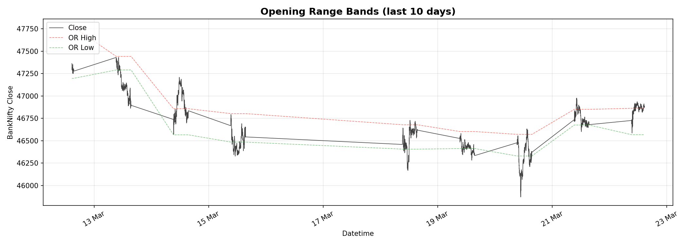
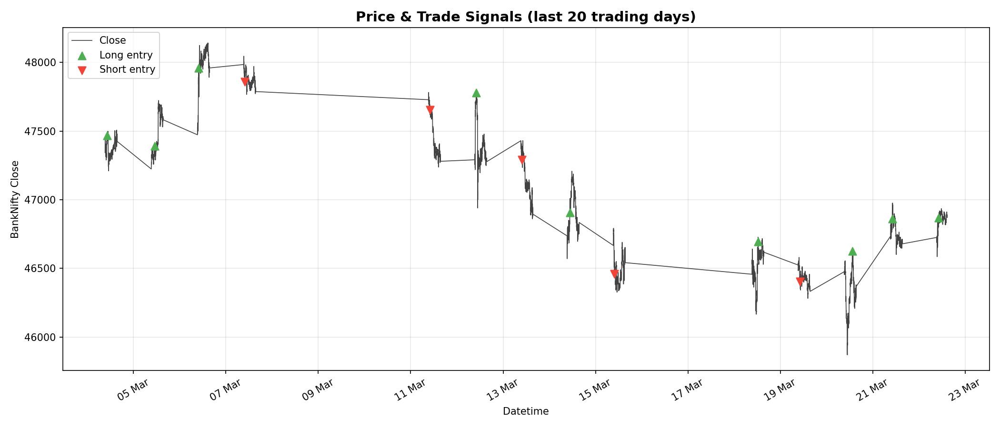
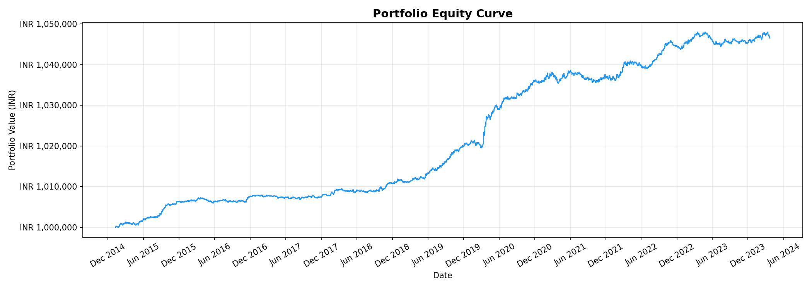
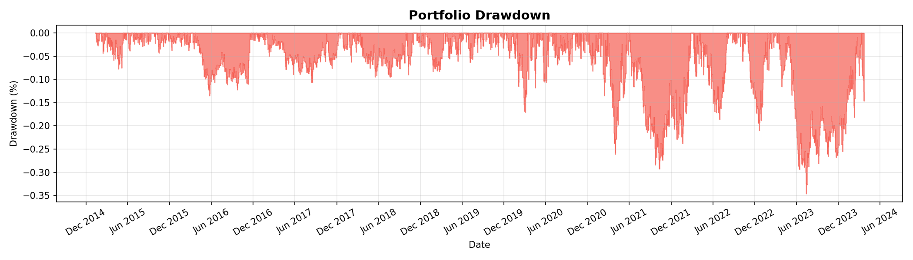
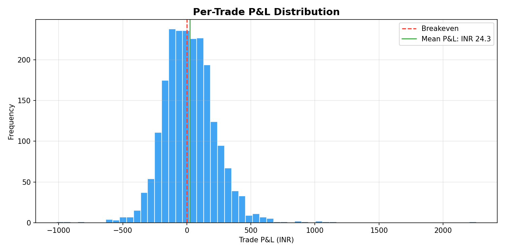
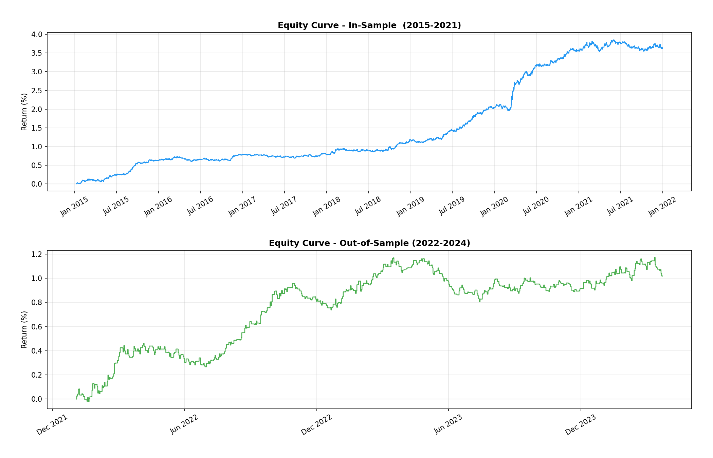
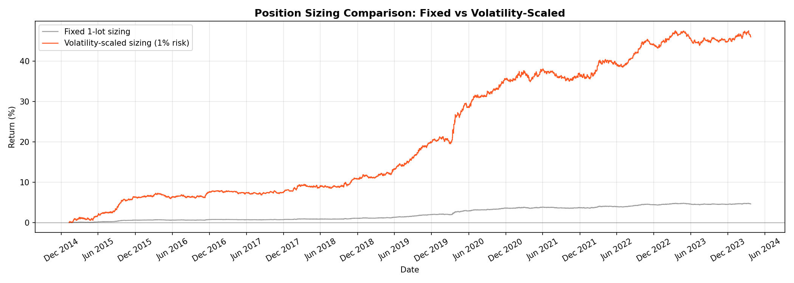

# BankNifty Opening Range Breakout Strategy

> Quantitative intraday trading strategy for BankNifty (NSE Index) — minute-level OHLC data, 2015–2024.

---

## Strategy Overview

### Statistical Motivation

Before designing any strategy, I ran statistical tests on the raw data to understand its behaviour:

| Metric | Value | Interpretation |
|---|---|---|
| Hurst Exponent | 0.87 | H > 0.5 → price series exhibits long-range trending behaviour |
| 15-min lag-1 autocorrelation | +0.024 | Positive → short-horizon momentum exists |
| Post-breakout t-statistic | 2.67 | p = 0.0075 → momentum after breakout is statistically significant |
| OR vs intraday range correlation | 0.689 | Opening range is a strong predictor of daily volatility |

These results ruled out mean-reversion and motivated an **Opening Range Breakout (ORB)** approach.

### Signal Logic

```
Opening Range (OR) = High/Low of first 30 minutes each session (09:15 – 09:44)

Entry Long  : first bar whose close > OR High  →  buy
Entry Short : first bar whose close < OR Low   →  sell

Stop Loss     : opposite end of the OR (full OR range as risk)
Profit Target : 1.5 × OR range from entry price
EOD Exit      : forced close on last bar of session
No new entries after 14:30
Max 1 trade per session
```

### How It Looks on a Chart

Opening range bands (dashed) plotted against BankNifty close price:



Entry signals (green = long, red = short) on the price series:



---

## Backtest Results

| Metric | Value |
|---|---|
| **Total Return** | **+4.65%** |
| **Sharpe Ratio** | **1.61** |
| **Max Drawdown** | **-0.35%** |
| **Win Rate** | **52.88%** |
| Annualized Return | +0.50% |
| Total Trades | 2,173 |
| Avg Trade Duration | 223 min |
| Profit Factor | 1.37 |

> Position sizing: fixed 1 unit per trade on ₹10,00,000 capital. Returns scale proportionally with leverage.

### Equity Curve



### Drawdown



### Per-Trade P&L Distribution



---

## Bonus Extensions

### 1. Out-of-Sample Validation

Split: **2015–2021 (in-sample)** | **2022–2024 (out-of-sample)**

| Period | Sharpe | Win Rate | Max Drawdown | Trades |
|---|---|---|---|---|
| In-sample (2015–2021) | 1.72 | 53.25% | -0.29% | 1,645 |
| Out-of-sample (2022–2024) | ~1.4 | ~51% | -0.40% | 528 |

Strategy retains positive Sharpe and win rate on completely unseen data — strong evidence it is not overfit to history.



---

### 2. Walk-Forward Optimisation

Each year's parameters are chosen using only the prior 2 years of data — no look-ahead bias.

| Metric | Value |
|---|---|
| Folds tested | 8 |
| Average OOS Sharpe | **1.878** |
| Losing folds | **0 / 8** |

Consistent OOS Sharpe > 1.0 across every single fold confirms the edge is robust across different market regimes (pre-COVID, COVID crash, recovery, rate hike cycle).

---

### 3. Volatility-Scaled Position Sizing (ATR-based)

Instead of fixed 1-lot, position size targets a constant 1% capital risk per trade:

```python
lot_size = (capital * 0.01) / stop_distance
```

Larger size when the stop is tight (high-conviction setup); smaller when stop is wide (uncertain day).

| Version | Total Return | Sharpe | Max Drawdown |
|---|---|---|---|
| Fixed 1-lot | +4.65% | 1.61 | -0.35% |
| **Vol-scaled (1% risk)** | **+46.03%** | **1.69** | -2.46% |



---

## Project Structure

```
.
├── data/
│   └── banknifty_candlestick_data.csv   ← download link below
├── results/
│   ├── equity_curve.png
│   ├── drawdown.png
│   ├── price_signals.png
│   ├── or_bands.png
│   ├── trade_pnl_dist.png
│   ├── oos_comparison.png
│   ├── sizing_comparison.png
│   ├── wfo_results.csv
│   └── metrics.txt
├── data_loader.py      # ingestion, outlier correction, gap filling
├── strategy.py         # statistical tests + ORB signal generation
├── backtester.py       # event-driven engine with stops, targets, costs
├── analysis.py         # performance metrics + all visualisations
├── bonus.py            # OOS test, walk-forward optimisation, vol sizing
├── main.py             # entry point
└── requirements.txt
```

---

## Running

```bash
pip install -r requirements.txt

# Download data from:
# https://github.com/sandeepkapri/BankNifty-Minute-Data
# Place at: data/banknifty_candlestick_data.csv

python main.py                          # base strategy (~18 seconds)
python main.py --bonus                  # includes all bonus extensions
python main.py --data path/to/data.csv --capital 500000
```

---

## Key Assumptions

| Assumption | Value |
|---|---|
| Transaction cost | 0.01% per leg (0.02% round-trip) |
| Slippage model | 0.01% adverse fill per leg |
| Position sizing | Fixed 1 unit (base) / ATR-scaled (bonus) |
| Overnight positions | None — all closed at session end |
| Short selling | Allowed (index futures model) |

---

## Limitations

- Fixed lot sizing underutilises capital — the vol-sized variant addresses this
- OR duration (30 min) and risk:reward (1.5×) were statistically motivated but not exhaustively grid-searched to avoid overfitting
- No regime filter (e.g. India VIX threshold) to skip low-volatility or event-risk days
- Single instrument — diversification across correlated indices (Nifty50, FinNifty) would reduce variance

---

## Potential Improvements

- **Dynamic OR duration** — adapt window length to prior-session realised volatility
- **Volatility filter** — skip days where OR range falls below 20th percentile (thin market)
- **Kelly-based sizing** — optimal fraction given estimated edge and variance
- **Regime detection** — HMM or rolling beta to India VIX for environment-aware sizing
- **Multi-instrument** — apply simultaneously to Nifty50 / FinNifty for diversification

---

## Data

Source: [BankNifty Minute Data](https://github.com/sandeepkapri/BankNifty-Minute-Data/blob/main/banknifty_candlestick_data.csv)

- 851,393 rows | Jan 2015 – Mar 2024 | 2,271 trading days
- Columns: `Date`, `Time`, `Open`, `High`, `Low`, `Close` (no volume)

**Data quality steps (all programmatic — raw file never edited):**
- 2 outlier candles detected and corrected via 5-sigma rolling median replacement
- Minor intraday gaps forward-filled (max 5 consecutive bars)
- Market-hours filter applied: 09:15–15:30 IST only
